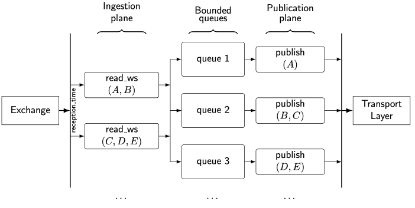

# Binance Depth Update Kafka Scraper

A high-performance, asynchronous Rust service that scrapes Binance WebSocket depth updates and publishes them to Kafka.

## Features

- Accepted input formats: **JSON** or **SBE** (depending on configuration)
- Output format: **Protobuf** (versioned via `Confluent Schema Registry`)
- Monitoring: `Prometheus`
- Websocket: `FastWebSockets`
- Kafka: `Rdkafka`
- Logging: Asynchronous and configurable using `tracing`

## Prerequisites

- Rust toolchain
- A running Kafka cluster
- Access to the required schema repositories
- (Optional) Binance API key for SBE access

## Usage

1. Fill in the required `.env` variables (see `.env.example`)
2. Create a `resources/symbols.yaml` file (see `resources/examples/symbols.yaml`)
3. Create a `resources/kafka-sink-config.yaml` file (see `resources/examples/kafka-sink-config.yaml`)
4. Run the application:

```bash
cargo build && cargo run
```

**Note 1**: reading access to the following repos is required:

- [market-streaming-infra-schema-core](https://github.com/charlescol/market-streaming-infra-schema-core)
- [market-streaming-infra-schema-binance](https://github.com/charlescol/market-streaming-infra-schema-binance)

**Note 2**: To run locally, you need to have a local Kafka instance running.

**Note 3**: To access the SBE API, you need to have a valid Binance API key (set in the `.env` file as `BINANCE_API_KEY`).

**Note 4**: To build a local Docker image, you need to have a valid ssh `id_rsa` key in the `.ssh` folder with the required permissions to access the repos mentioned in _Note 1_.

## Architecture

<p>
  
</p>
